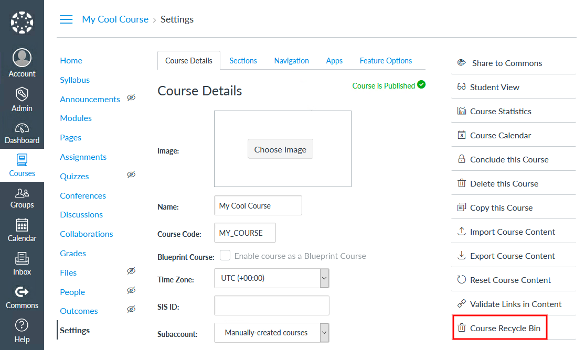
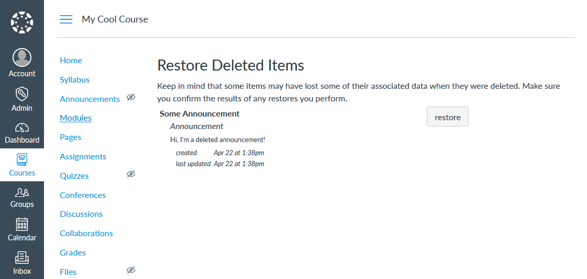

# Canvas LMS Course Recycle Bin Plug-in

Plugin for the [Canvas LMS theme app](https://www.npmjs.com/package/@artevelde-uas/canvas-lms-app) that adds a
'Course Recycle Bin' button to the course settings menu.

[](https://www.npmjs.com/package/@artevelde-uas/canvas-lms-enable-course-recycle-bin-plugin)
[](https://spdx.org/licenses/MIT)
[](https://www.npmjs.com/package/@artevelde-uas/canvas-lms-enable-course-recycle-bin-plugin)

#### Button placement:

A new button will be added on the cource settings page:



#### Recycle bin page:

This will give you access to the hidden recycle bin page:



## Installation

Using NPM:

    npm install @artevelde-uas/canvas-lms-enable-course-recycle-bin-plugin

Using Yarn:

    yarn add @artevelde-uas/canvas-lms-enable-course-recycle-bin-plugin

## Usage

Just import the plug-in and add it to the Canvas app:

```javascript
import canvas from '@artevelde-uas/canvas-lms-app';
import enableCourseRecycleBinPlugin from '@artevelde-uas/canvas-lms-enable-course-recycle-bin-plugin';

canvas.addPlugin(enableCourseRecycleBinPlugin);

canvas.run();
```

## Translations

The plug-in is currently translated in the following languages: English, Dutch, French, German, Spanish, Italian,
Chinese and Japanese. (Some of these are done with a translation tool so they may not be accurate.)
